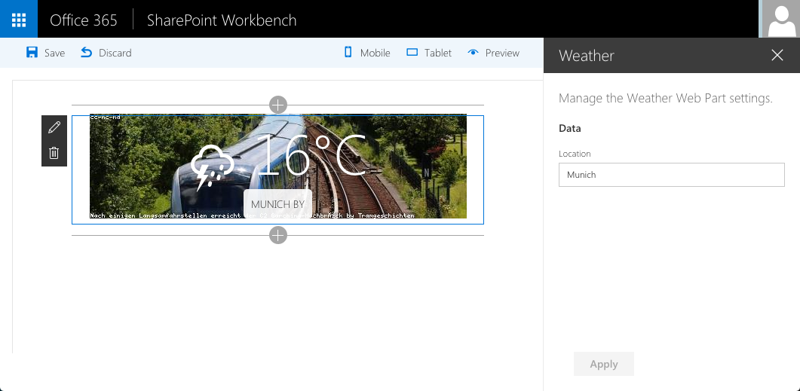

# SharePoint Framework Weather Web Part

Web Part built using the SharePoint Framework showing current weather for the specified location.

## Running this Web Part

- clone this repo
- `$ npm i`
- `$ gulp serve`

## Features

The Weather web part is a client-side web part built on the SharePoint Framework. It uses jQuery and the simpleWeather jQuery plugin ([http://simpleweatherjs.com](http://simpleweatherjs.com)) loaded from CDN to show the current weather for the given location.

This web part illustrates the following concepts on top of the SharePoint Framework:
- loading jQuery from CDN
- loading non-module jQuery plugins with configured dependency on jQuery
- using non-reactive web part property pane
- using conditional rendering for one-time web part setup